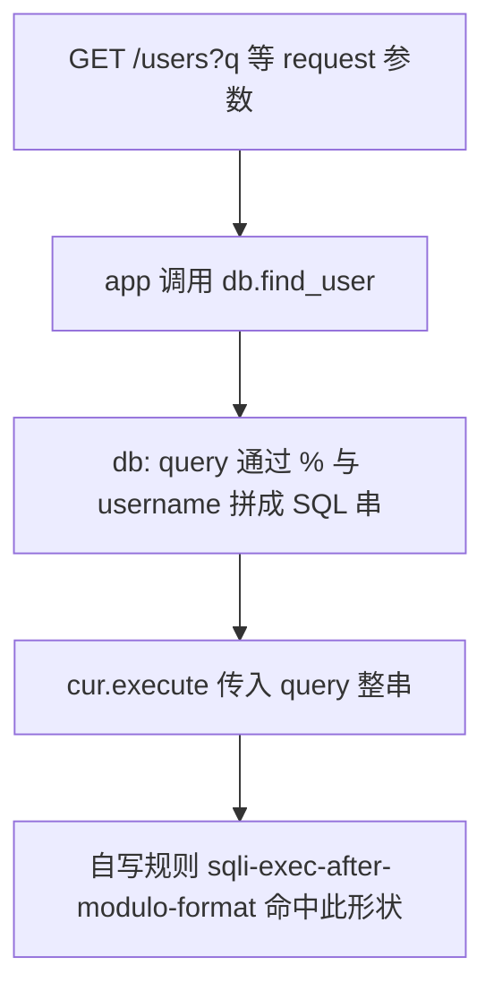

# Semgrep 实验报告：从源码定源到自写规则与结论

| 项目 | 内容 |
|------|------|
| 课程作业 | 开源软件 / Semgrep 大作业 |
| 姓名 | 付乐宇 |
| 学号 | 25140901 |

---

## 一、实验目标

在真实小型仓库中完成**人工源码分析**，将可重复的判断写为 **一条** Semgrep 自写规则，**仅**使用自写规则文件对仓库扫描并得出结论，材料可追溯、可复现。

**扫描约束**：扫描时只使用本实验编写的规则，命令形如 `semgrep -c <规则文件> ...`；**不得**使用 `p/...`、`p/owasp-top-ten` 等现成规则包作为本次实验配置。本报告只提交 **Markdown**（不附 PDF 亦可符合「完整过程说明」的文本要求）。

---

## 二、人工源码分析：从 Source 到 Sink

### 2.1 Source（不可信 / 外界影响的输入）

通读 `app.py` 与 `db.py` 后，将下列入口视为与 SQL 行为相关的**数据来源**（Source）：

- **Web 查询参数**：`GET /users` 中 `q`（用户名检索）、`email`（按邮箱查），经 `request.args.get` 取得字符串。
- **注册表单**：`POST /register` 中 `username`、`email` 等，经 `request.form` 取得后传入 `db.create_user`。
- **登录**（`POST /login`）同样将 `username` 传入 `db.find_user`。

上述路径与「不可信/外界影响数据」在人工上相关；具体能否注入取决于下游是否**参数化**。

### 2.2 数据流与汇聚点

1. `app.py` 中 `users()`：`q` → `db.find_user(q)`；`email` 参数 → `db.find_user_by_email(eq)`。
2. `register()`：表单 → `db.create_user(username, pw_hash, email)`。

**汇聚**在 `db.py`：若用 **拼好的整串** 调用 `cur.execute(query)` 而非 `execute("…?", (…,))`，则失去 SQLite 以占位符分界的保护。

### 2.3 Sink 与坏模式（人工可三类；本实验规则只刻画其中一类）

| 位置 | 坏模式 | 本实验是否写规则 |
|------|--------|------------------|
| `find_user` | `"%s" % username` → `cur.execute(query)` | **是**（`sqli-exec-after-modulo-format`） |
| `find_user_by_email` | f-string 拼 `email` → `execute(query)` | 否（仅人工标出） |
| `create_user` | `"...".format(...)` → `execute(query)` | 否（仅人工标出） |

对比：`store_token` 等使用 `execute("...?", (元组,))` 的写法，不在本条规则的「先拼整串再 `execute(变量)`」判据内。

### 2.4 为何适合用 Semgrep 与「合适触发」判据（对唯一规则）

**为何适合**：`%` 拼接得到 SQL 串、再**同一函数内** `execute(该变量)` 的结构，可用多行 `pattern` 在过程内稳定匹配。

**合适触发**判据：

1. 存在 `query = "…" % 变量` 形式的 **SQL 模板与值拼接** 赋值（本规则针对 **百分号格式化**）。
2. 随后出现 `*.execute(该变量)`，且**无**作为第二实参的**参数元组**的典型参数化用法。
3. 当 1 中变量来自上层的 `request` 等时，与「用户影响数据进入 SQL 字面量」的**风险叙事**在人工上对齐；规则本身只落实 **1+2** 的静态形状。

---

## 三、从分析到规则（Think）

- **只写一条的原因**：在多种拼串方式中，选取 **`%` 格式化** 作为课程实验的**可重复、可测**落点，一条 `id` 对应 `db.find_user` 的实代码。
- **与测试的对应**：`semgrep-lab/rules/sqli_dynamic_execute.test.py` 中 `# ruleid: sqli-exec-after-modulo-format` 为应命中，参数化样例前 `# ok: sqli-exec-after-modulo-format` 为应不命中。

### 3.1 源码级分析流程图（一图）

与 `semgrep-lab/analysis-flowchart.md` 中 Mermaid 一致，此处从略；图中**自写规则**节点仅 `sqli-exec-after-modulo-format` 一条。



---


## 四、自写规则与文件说明

| 文件 | 作用 |
|------|------|
| `semgrep-lab/rules/sqli_dynamic_execute.yaml` | **仅含一条** `sqli-exec-after-modulo-format` |
| `semgrep-lab/rules/sqli_dynamic_execute.test.py` | 命中 / 不命中用例 |
| `semgrep-lab/output/semgrep.txt` | 扫描命令与输出摘录 |

---

## 五、仅自写规则扫描：命令与结果

**规则测试**（在本作业目录根目录下）：

```bash
semgrep --test semgrep-lab/rules --metrics=off
```

**全项目扫描**（仅本规则文件）：

```bash
semgrep -c semgrep-lab/rules/sqli_dynamic_execute.yaml .
```

**排除本规则测试文件、只看业务时**可附加 `--exclude "sqli_dynamic_execute.test.py"`；此时 **`db.py` 中预期 1 条**命中（`find_user` 处）。

**详细终端原文**：`semgrep-lab/output/semgrep.txt`。

**结论摘录**：

- **命中位置**：自写规则与 **`db.find_user` 中 `%` + `cur.execute(query)`** 及测试文件中的**对应用例**一致。
- **与人工分析是否一致**：对 **`%` 这一形态** 一致；`find_user_by_email`、`create_user` 在人工中仍为**同类风险**，但**本实验未写**对应规则，扫描**不报警**，属**有意的**覆盖范围，而不是工具矛盾。
- **漏报（至少一句）**：凡非「`"..."%…` 再同函数 `execute(变量)`」的拼 SQL 方式，包括 f-string、多行 `.format`、或跨函数传递，**均不会**被本条规则报告。
- **误报（至少一句）**：若 `%` 两侧仅为**受控常量**或**信任域内**标识符，而代码形态仍满足 1+2，则可能出现需人工用判据 3 排除的误报。

---

## 六、修复思路（最小化）

- 将 `find_user` 等改为 `execute("SELECT ... WHERE username = ?", (username,))`；`find_user_by_email` / `create_user` 同理用占位符，**不**把外值写进引号内字面量。

---

## 七、可复现检查清单

- [x] 仅使用 `semgrep -c semgrep-lab/rules/sqli_dynamic_execute.yaml` 扫描，未加现成包。
- [x] `semgrep-lab/output/semgrep.txt` 已记录命令与主要输出。

---

*规则与业务代码以仓库内文件为准。*
